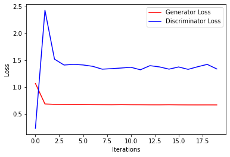

## Generative adversarial network (GAN)

We use GAN to implement colorization on images.

Before the model training, the generated images are fuzzy and the colorization is not clear.

To illustrate, in each picture below, there are 3 random images being picked to plot in each column. While for a fixed column (image), three rows from the top to the botton are the single-color images (1-channel), generated images, and the real_images. We can see than with epochs growing, the generated images are looked increasingly real and clear and much more like the real images.

After 20 epochs of training, the generated became much more resemble the original images and became clearer, showing our Generator-Discriminator model is working.

The loss curve below shows the model converges fast and has lower loss of discriminator than that of generator.

