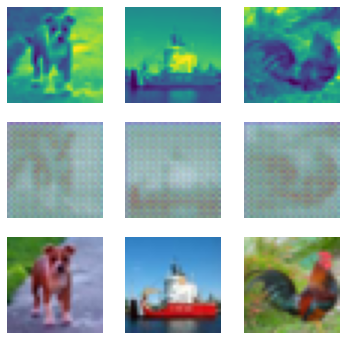
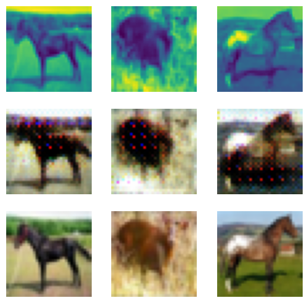

## Generative adversarial network (GAN)

Use GAN to implement colorization on images

Before the model training, the generated images are fuzzy, as shown below

After 20 epochs of training, the generated became much more resemble the original images and became clearer, showing our Generator-Discriminator model is working.

