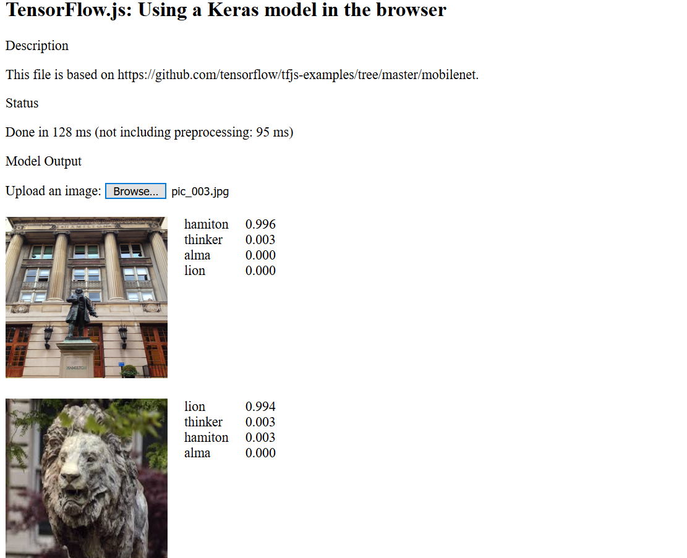

# Applied Deep Learning
COMSW 4995 Applied Deep Learning
### Project 2

Convolution Neural Network for image identification
1. Flowers
2. Columbia Landmarks

Use Tensorflow.js to visualize the model:
 - Download these files to your local machine and reate a directory, say `tfjs`
 - Start a HTTP Server on your local machine (if you simply open index.html in a browser, you may run into security protections that prevent it from loading scripts)
    - To start a server, you can use one built-in to Python. First, cd into your tfjs directory.
     - If you have Python2 installed, run this command in your terminal:
     
       `$ python -m SimpleHTTPServer [port]`
     - If you have Python3:
     
        `$ python -m http.server [port]`

 - Open a browser (point the URL to localhost:8888). Your webpage should appear.
 If everything is working, you could upload a picture and see model prediction result.

When you upload your Columbia landmark image, you should see the web page showing the prediction (out of 4 classes) and its confidence score. The following is an example.

  

